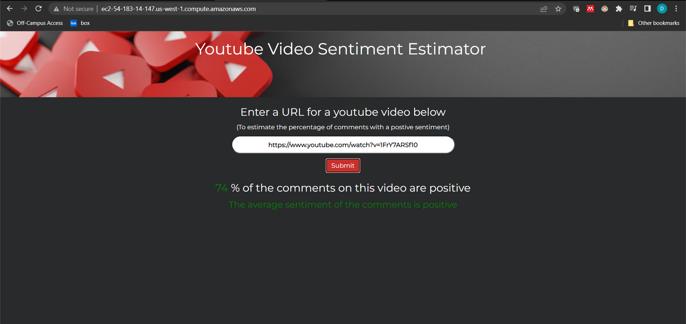
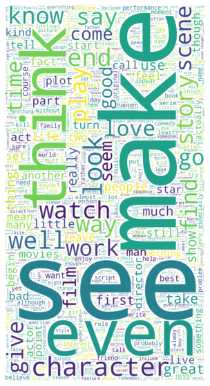
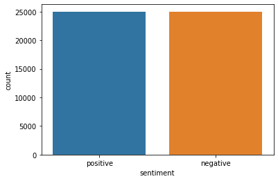
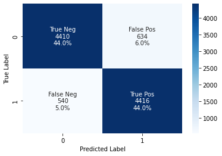
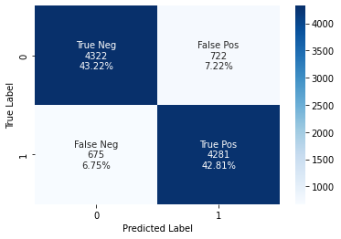

# YouTube Comments Sentiment Estimator

  

### Web App Link: http://ec2-54-183-14-147.us-west-1.compute.amazonaws.com/

## Overview
* Used the IMDB movie review sentiment database for training 
* Calculated word embeddings using word2vec/spacy and trained SVC model for sentiment classification
* Built webapp that calls Youtube API to retrieve comments for a user-inputed youtube video URL
* Calculate average word embedding for each comment, apply SVC model to each comment to estimate sentiment, and calculate percentage of positive comments
* Deployed full stack web app on AWS EC2 using gunicorn as a wsgi server and nginx as a reverse proxy server

## Resources
**Python version:** 3.8

**Packages:** AWS, EC2, amazon RDS, Spacy, sqlite3, pandas, numpy, sklearn, XGBoost, SVA, seaborn, requests, flask, pickle

**Languages:** python, MYSQL, SQLite, JavaScript, HTML, CSS

## TF-IDF Model (using NLTK)
### Data Cleaning and Feature Engineering

  
  

* Used the IMDB movie review sentiment database for training 
https://www.kaggle.com/datasets/lakshmi25npathi/imdb-dataset-of-50k-movie-reviews 
* Removed stop  words and lematized all words
* Created a TF-IDF model with 2500 features
 
### Model Development
* Split the data into train and test sets (20% test) with the document sentiment (positive or negative) as the target value
* Due to the high dimensionality of the dataset, I tested random forest, XGB, SVC, and Lasso models 
* Selected the SVC model as the model for productionalization
  
### Model performance

  

The SVC model achieved an accuracy of 87% for predicting the sentiment (positive or negative)

## Word Embedding Model (using SpaCy)
### Data Cleaning and Feature Engineering
* Used the IMDB movie review sentiment database for training 
https://www.kaggle.com/datasets/lakshmi25npathi/imdb-dataset-of-50k-movie-reviews 
* Used word2vec and spacy word embedding model
* Calculated vector for each document (comment) by averaging word embeddings for all words in a document
 
### Model Development
* Split the data into train and test sets (20% test) with the document sentiment (positive or negative) as the target value
* Due to the high dimensionality of the dataset, I tested random forest, XGB, SVC, and Lasso models 
* Selected the SVC model as the model for productionalization
  
### Model performance

  

The SVC model achieved an accuracy of 87% for predicting the sentiment (positive or negative)

## Model Productionalization

  

* Used Youtube Comments API to automatically retrieve a list of comment strings for a given link inputted by the user
* Calculate word embeddings for each comment for a given video
* Implement SVC model to predict sentiment of each comment
* Calculate the percentage of comments that have a positive sentiment
* Created flask API endpoint 
* Wrote a full stack web application in HTML, CSS, and JavaScript
* Deployed web app on AWS EC2 using gunicorn as a wsgi server and nginx as a reverse proxy server 

## Future work
* Working on improving documentation
* Improved error handling in the web app and the API
* The IMDB database and youtube comment data are not directly comparable. A better training dataset is necessary
